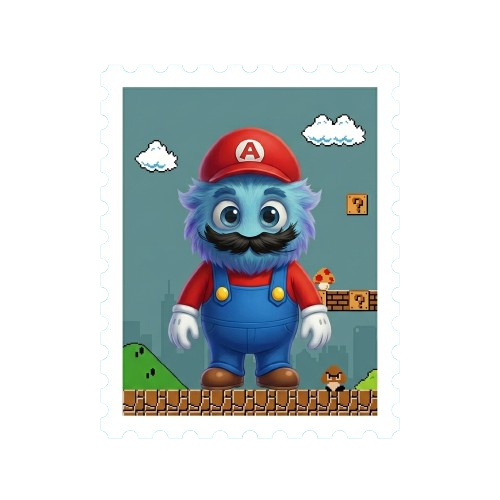
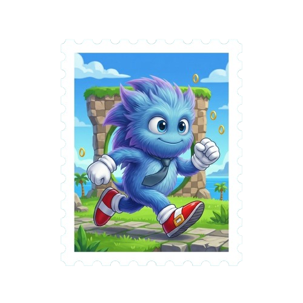
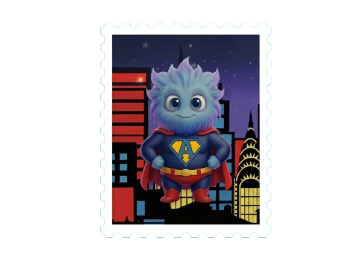
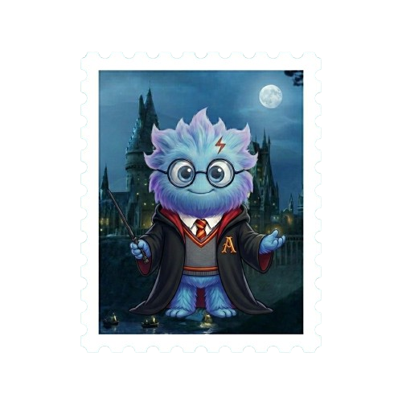
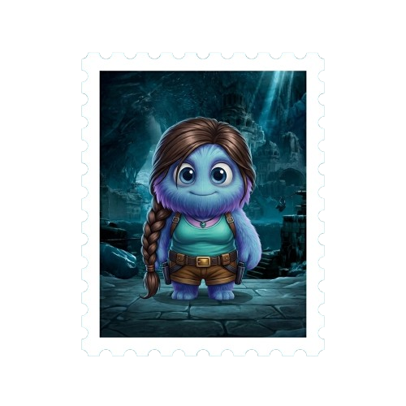
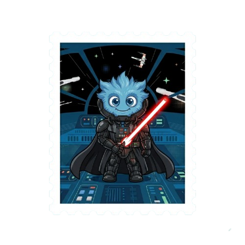
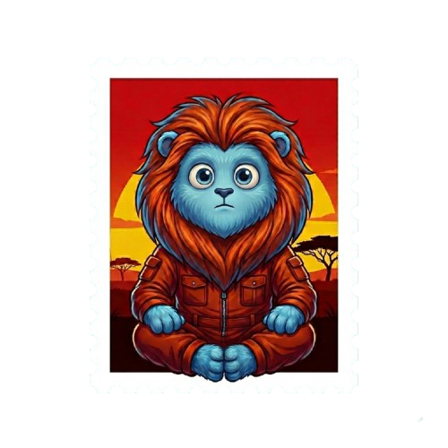
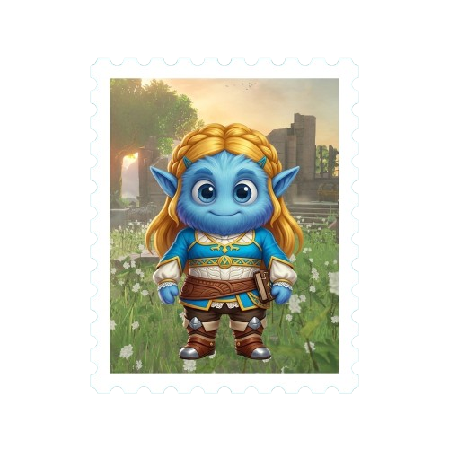

Este diretório deve conter as imagens de selo usadas pelo componente `BadgesSection`.

Coloque os arquivos PNG com os nomes e ordem abaixo:

- `badge-1.png`  — Super Tarefa Bros! (50 pts)
- `badge-2.png`  — Velocidade de Entrega (100 pts)![alt text]
- `badge-3.png`  — O Homem de Aço Ganhou Pontos (150 pts)
- `badge-4.png`  — A Câmara dos Segredos Produtivos (300 pts)
- `badge-5.png`  — A Origem das Entregas (500 pts)
- `badge-6.png`  — Com Grandes Pontos Vêm Grandes Recompensas (400 pts).png>)
- `badge-7.png`  — A Recompensa Contra-Ataca (750 pts)
- `badge-8.png`  — O Rei das Metas (875 pts)
- `badge-9.png`  — A Lenda do Funcionário do Tempo (1000 pts)

O componente `BadgesSection` está configurado para carregar as imagens diretamente deste diretório via rota pública.
